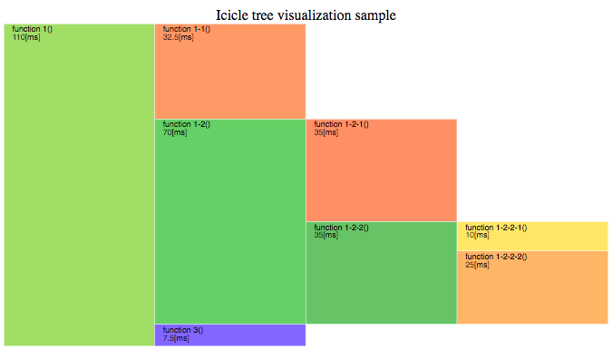

# icicle_tree

## how to use
run below command and access to http://localhost:8080
```
python3 -m http.server 8080
```

maybe you must use force update button of web browser (e.g. shift + click)

## example


## FYI
* [階層構造を持つデータの可視化 \- Qiita]( https://qiita.com/yuichy/items/0fc278cee4604160e6fd )
* [グラフ作成のためのチートシートとPythonによる各種グラフの実装 \- Qiita]( https://qiita.com/4m1t0/items/76b0033edb545a78cef5#%E6%A3%92%E3%82%B0%E3%83%A9%E3%83%95bar-plot )
* [Icicle / D3 / Observable]( https://observablehq.com/@d3/icicle )
* [SnakeViz]( https://jiffyclub.github.io/snakeviz/ )
* [dangom/icicle\-tree\-melodic: Icicle tree to visualize the variance explained by each IC component, as output from MELODIC\.]( https://github.com/dangom/icicle-tree-melodic )
